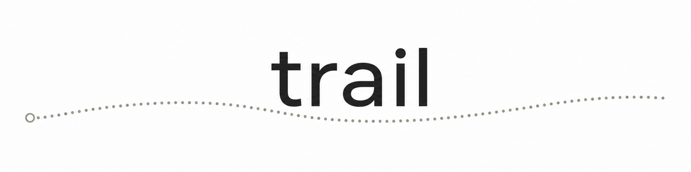

<div align="center">



**Shared, append-only memory for your team and its AI coding agents.**

Plain Markdown in your repo · opens as an Obsidian vault · links to Jira / Linear / GitHub
No database. No daemon. No cloud.

</div>

---

## Why

An agent forgets everything the moment its session ends. Add a second agent, or a new teammate, and they start from scratch. They re-decide things you already settled. They ask again how the tests run. They break a convention nobody bothered to write down.

`trail` is the team's operational memory: tasks, decisions, research and a daily log, written as Markdown that lives in your repo and travels with `git`. Humans read and write it. So do Claude Code, Codex and Cursor. It isn't a tracker. It hangs off the one you already use (Jira, Linear, GitHub) by linking each note to a ticket ID.

## What makes it different

- **Plain Markdown, in your repo.** Everything is a `.md` file under `.trail/`, reviewed in a PR like any other code.
- **Opens as an Obsidian vault, no sync.** `.trail/` *is* a vault. Obsidian reads the same files the CLI writes, live, so you get backlinks and the graph view for nothing.
- **Cross-vendor by design.** The same memory works with Claude Code, Codex, Cursor and Cline at once. No lock-in.
- **Hangs off your tracker.** Link any note to a Jira, Linear or GitHub ticket. The tracker stays the source of truth for *state*; `trail` holds the *context*.
- **Concurrency without a daemon.** One file per task, one active writer at a time, atomic writes and lazy locks. The same way `git` locks. Nothing runs in the background.
- **Provenance built in.** Every note records who wrote it (`author`) and which agent (`agent`).

## Structure

```
.trail/
├── _hot.md          # live cache: what's active right now (under 400 words)
├── WIP/             # active tasks, one file per task, append-only timeline
├── DONE/            # completed tasks
├── PAUSED/          # blocked or parked tasks
├── Decisions/       # lightweight ADRs: YYYY-MM-DD-slug.md
├── Research/        # investigations
├── Log/             # daily log: YYYY-MM-DD.md
└── .obsidian/       # local, generated by trail (gitignored)
```

## Quickstart

```bash
bunx trail init                       # scaffold .trail/ (+ a pretty Obsidian config)
trail task "auth multi-tenant"        # start a task → WIP/auth-multi-tenant.md
trail note auth-multi-tenant "RLS on every table, tenant_id from JWT"
trail link auth-multi-tenant LIN-1234 # link to a Linear/Jira/GitHub ticket
trail decide "use pgvector over a separate vector db"
trail done auth-multi-tenant          # → DONE/, releases the claim
trail hot                             # print the live cache
trail open                            # open .trail/ in Obsidian
```

## Design

The full convention lives in [`SPEC.md`](./SPEC.md): folder layout, frontmatter schema, concurrency model and command reference. It's deliberately small.

## Status

Early. `v0.1` covers the daily loop (init · task · note · decide · research · log · done · link · hot · blame · check). Next up: an MCP server so agents call the same commands as tools, then `git`-based team sync. See the roadmap in [`SPEC.md`](./SPEC.md#roadmap).

## License

MIT © [frizynn](https://github.com/frizynn)
